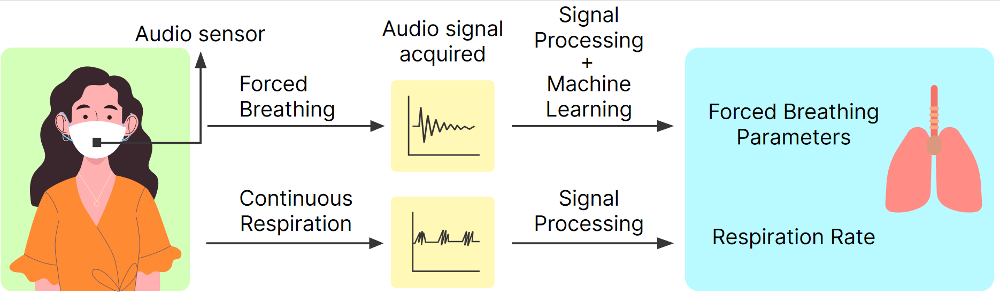

## SpiroMask: Measuring Lung Function Using Consumer-Grade Masks

**Code Repository For Paper Accepted in the ACM Transactions For Computing In Healthcare HEALTH (October 2022)**.

This repository contains codes to reproduce the figures and results. The folders are divided into *Forced Breathing* and *Tidal Breathing* The description of each file is mentioned below. 

Please note that the data will be made available at camera ready. As such, the scripts shared would not execute without the data. Once can generate synthetic demo data to test the algorithms. 

**Spirometry**
- ``script-1-generate-dataframe-envelope-and-its-features.ipynb``: Use this file to generate acoustic features of forced breathing. The generated data will be stored as a dictionary in a pickle file.
- ``script-2-generate-features-*.ipynb``: This file generates acoustic features for estiamting PEF, FEV1 and FVC. The generated data will be stored as a npy file.
- ``script-3-LOOCV.ipynb``: Performs LOOCV. 
- All plots are generated by scripts inside the *generate-plots* folder

**Tidal Breathing**
- ``spiroMask-nn-classifier.ipynb``: Classifies between 'Tidal Breathing', 'Noise' and 'Speech'. 
- ``tidal.ipynb``: Depends on the data classified as 'Tidal Breathing' from the the ``spiroMask-nn-classifier.ipynb``. Uses the accelerometer data and tidal breathing data to extract respiration rate. All data files are 20 second long.

